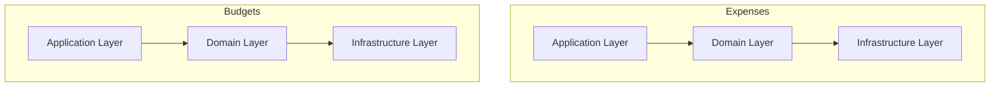

# Expense Tracker Service

Expense Tracker Service es una API REST desarrollada en Java y Spring Boot que permite gestionar los gastos personales de los usuarios y compartirlos con otros usuarios. El proyecto está diseñado para facilitar la organización financiera, proporcionando una forma intuitiva de registrar, categorizar y analizar gastos.

## Motivación

El objetivo de este proyecto es explorar el desarrollo de aplicaciones monolíticas utilizando Spring Boot, empleando patrones modernos y mejores prácticas para diseñar y construir un monolito escalable y mantenible.

## Demo

https://expenses-dev.hanluc.dev/doc/swagger-ui/index.html

## Features

- Create new expense entries
- View a list of all expense entries
- Update existing expense entries
- Delete expense entries
- Filter and sort expenses by various criteria (date, category, amount, etc.)
- Generate reports and analytics on expense data

## Tech Stack

- Java 21
- Spring Boot 3.7.x
- Spring Data JPA
- PostgreSQL
- Maven
- Docker
- TestContainer
- Swagger/OpenAPI for API documentation

## Arquitectura

El proyecto sigue una Arquitectura Limpia (Clean Architecture) con un diseño orientado a Domain-Driven Design (DDD). Este enfoque garantiza un código mantenible, escalable y bien organizado.



## Getting Started

### Prerequisites

- Java 21 or higher
- Maven 3.8.x
- Docker

### Installation

1. Clone the repository:

   ```
   git clone https://github.com/jalucenyo/expense-tracker-service.git
   ```

2. Navigate to the project directory:

   ```
   cd expense-tracker-service
   ```

3. Build the project:

   ```
   mvn clean install
   ```

4. Run the application:

   ```
   mvn spring-boot:run
   ```

   The application will start running on `http://localhost:8080`.

### API Documentation

The API documentation is available at `http://localhost:8080/doc/ui` when the application is running.

### Configuration

The application's configuration can be found in the`application.yml` file. You can customize the database connection, server port, and other settings as needed.

### Testing

The project includes unit and integration tests. You can run the tests using the following command:

```
mvn test
```

## Contributing

If you find any issues or have suggestions for improvements, feel free to open a new issue or submit a pull request.

## License

Pending.
